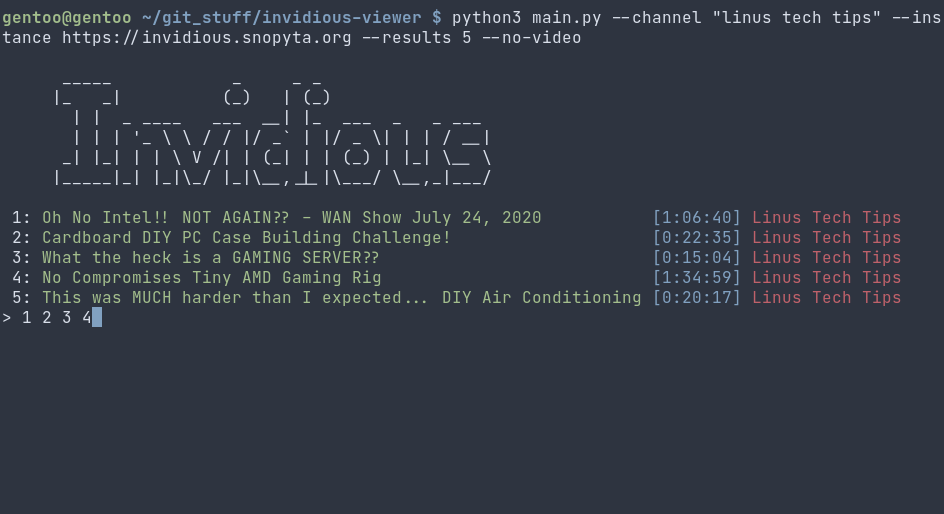
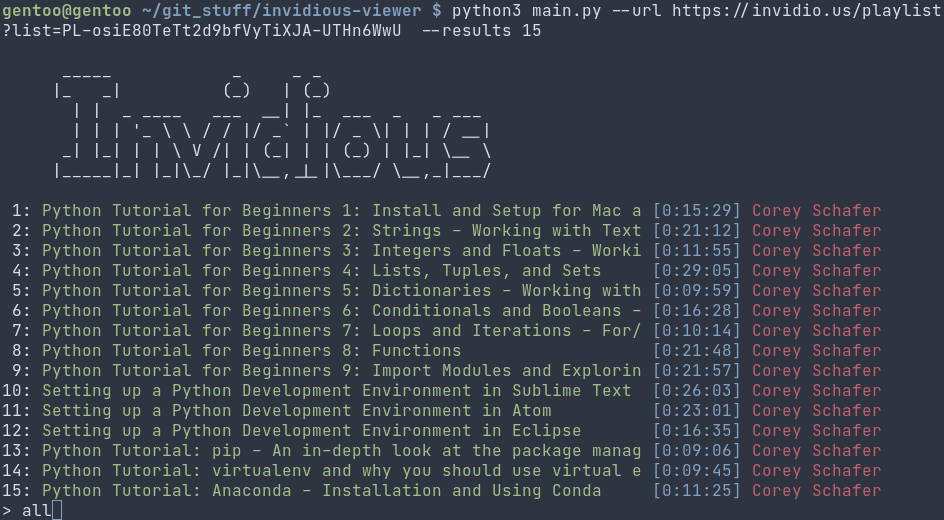

# invidious-viewer
Simple python application to watch YouTube videos through the <a href="https://github.com/iv-org/invidious">invidious</a> API.

# Usage
Clone the repository

Install the requirements
`pip install -r requirements.txt`

Note :
The MPV player is required, along with `libmpv.so` which should be provided by your distribution.

Additional usage options :
```
usage: main.py [-h] [-i INSTANCE] [-r RESULTS] [-n]
               [-u URL | -c CHANNEL | -p | -t]

optional arguments:
  -h, --help            show this help message and exit
  -i INSTANCE, --instance INSTANCE
                        Specify a different invidious instance
  -r RESULTS, --results RESULTS
                        Return specific number of results
  -n, --no-video        Play audio only
  -u URL, --url URL     Specify link to play [Video/Playlist]
  -c CHANNEL, --channel CHANNEL
                        View videos from a specific channel
  -p, --popular         View popular videos (Default invidious page)
  -t, --trending        View trending videos
```

Example :
`python3 main.py --channel "linus tech tips" --instance https://invidious.snopyta.org --results 5 --no-video`

Returns the first 5 results from the LTT channel, disables video playback, and fetches all URLs from the <a href="https://invidious.snopyta.org/">Snopyta instance</a>.

# Screenshots



